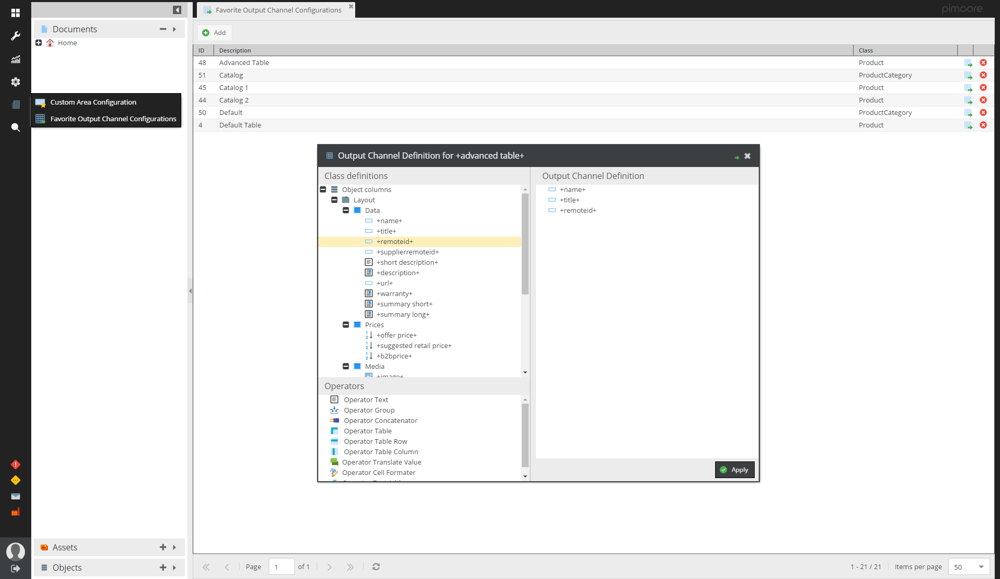
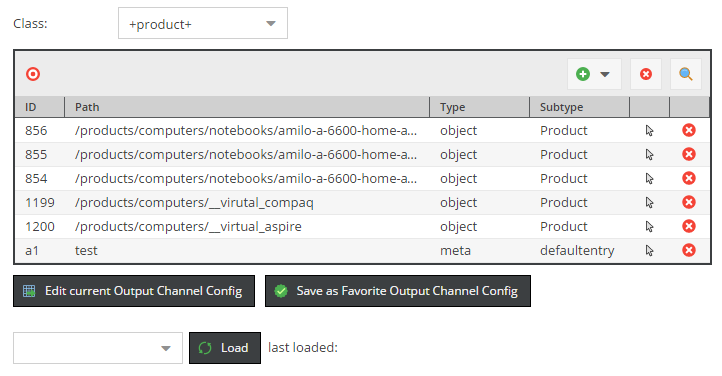

# Web2Print Tools Bundle for Pimcore

Adds following additional features to the web2print functionality of Pimcore.
- Favorite Output Channels
- Document Editable for Configurable Tables
- PDFreactor controller tool
- table of contents creation (awesomizr.js)
 

## Favorite Output Channels
Based on the OutputDataConfigToolkit (https://github.com/pimcore/output-data-config-toolkit) this feature allows
to save output channels centrally and reuse them in several places.




## Document Editable for Configurable Tables
Editable for adding tables with configurable columns based on the output channels to documents.



Usage:
```twig
{{ pimcore_outputchanneltable('tableconfig')|raw }}
```
Also see included sample areas PrintColumnAttributeTable and PrintRowAttributeTable.


## PDFreactor PDF Creation Helper
PDFreactor PDF Creation Helper allows you to integrate web2print functionality directly into the controller and 
creates a pdf response from a given HTML. 

Usage in controller action:
```php
<?php

    public function myAction() {

        //do some stuff...

        $reactor = new ReactorPDF();
        return $reactor->createPDFResponse($renderedHTML);

    }
```

With url parameter html=1 pdf rendering is deactivated.


## Create table of contents

```js

/**
 * - include bundles/web2printtools/vendor/js/awesomizr.js
 * - include bundles/web2printtools/vendor/css/awesomizr.css
 */

Awesomizr.createTableOfContents({
    insertiontarget: '#toc-wrapper',
    elements: ['h1','h2'],
    container: {tag: 'ul', addClass: 'toc'},
    line: {tag: 'li'},
    disabledocumenttitle: true,
    toctitle: ' ',
    text: function (elem) {
        return elem.textContent;
    }
});

```
See example: [toc.js](https://github.com/pimcore/web2print-tools/blob/master/src/Resources/public/examples/toc.js)
See full documentation and examples: [pdfreactor-manual](http://www.pdfreactor.com/product/doc/manual.pdf)

## Running with Pimcore >= 11.0 
If you are using or upgrading to pimcore 11, then please make sure that the `pimcore/admin-ui-classic-bundle` bundle is installed.

```bash
composer require pimcore/admin-ui-classic-bundle
```

## Running with Pimcore < 5.4
With Pimcore 5.4 the location of static Pimcore files like icons has changed. In order to make this bundle work 
with Pimcore < 5.4, please add following rewrite rule to your `.htaccess`.
```
    # rewrite rule for pre pimcore 5.4 core static files
    RewriteRule ^bundles/pimcoreadmin/(.*) /pimcore/static6/$1 [PT,L]
``` 

# Migration from Pimcore 4
- change table name from `plugin_web2print_favorite_outputdefinitions` to `bundle_web2print_favorite_outputdefinitions`
```sql
RENAME TABLE plugin_web2print_favorite_outputdefinitions TO bundle_web2print_favorite_outputdefinitions; 
```
- changed namespace from `Web2Print` to `Web2PrintToolsBundle`
- renamed permission from `plugin_web2print_favourite_output_channels' to `web2print_web2print_favourite_output_channels`
```sql
UPDATE users_permission_definitions SET `key` = REPLACE(`key`, 'plugin_web2print_favourite_output_channels', 'web2print_web2print_favourite_output_channels');
UPDATE users SET permissions = REPLACE(`permissions`, 'plugin_web2print_favourite_output_channels', 'web2print_web2print_favourite_output_channels');
```
- removed Custom Document Areas
- PDFReactor controller plugin replaced by PDFreactor PDF Creation Helper
