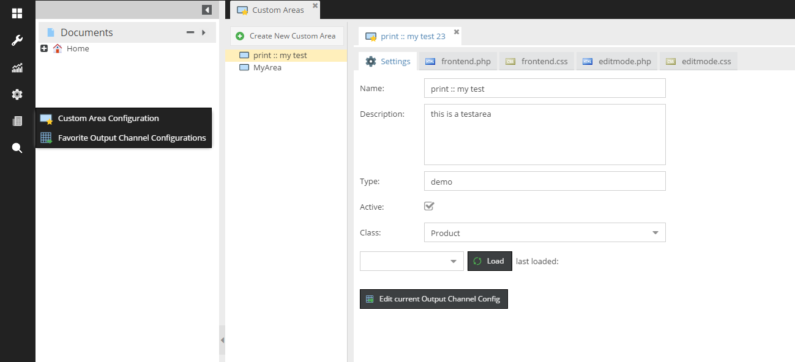

   
    
# Web2Print Plugin for pimcore

Adds following additional features to the web2print functionality of pimcore.
- Favorite Output Channels
- Document Editable for Configurable Tables
- Custom Document Areas
- PDFreactor controller plugin
- samples for document areas, css styles, etc.
- table of contents creation (awesomizr.js)


## Favorite Output Channels
Based on the OutputDataConfigToolkit (https://github.com/pimcore-partner/Elements_OutputDataConfigToolkit) this feature allows
to save output channels centrally and reuse them in several places.


## Document Editable for Configurable Tables
Editable for adding tables with configurable columns based on the output channels to documents.


Usage:
```php
<?php
echo $this->outputchanneltable("tableconfig");
```
Also see included sample areas PrintColumnAttributeTable and PrintRowAttributeTable.


## Custom Document Areas
Custom Document Areas allow area creation directly in pimcore backend. Users can add frontend and editmode php/css and also can
access list of object data assigned in editmode. The data is available in frontend php file as ```$this->dataArray```




## PDFreactor Controller Plugin
The PDFreactor Controller Plugin allows to integrate web2print functionality directly to an controller action without using
web2print documents. It just renders the action output as PDF and returns it instead of html.

Usage in controller action:
```php
<?php

    public function myAction() {

        //do some stuff...

        $front = Zend_Controller_Front::getInstance();
        $front->registerPlugin(new \Web2Print\Controller\Plugin\ReactorPDF(), 777);

    }
```

With url parameter html=1 pdf rendering is deactivated.


## Create table of contents

```js

/**
 * - include plugins/Web2Print/static6/vendor/js/awesomizr.js
 * - include plugins/Web2Print/static6/vendor/css/awesomizr.css
 */

Awesomizr.createTableOfContents({
    insertiontarget: '#toc-wrapper',
    elements: ['h1','h2'],
    container: {tag: 'ul', addClass: 'toc'},
    line: {tag: 'li'},
    disabledocumenttitle: true,
    toctitle: ' ',
    text: function (elem) {
        return elem.textContent;
    }
});

```
See example: [toc.js](https://github.com/pimcore-partner/Web2Print/blob/master/static6/examples/toc.js)
See full documentation and examples: [pdfreactor-manual](http://www.pdfreactor.com/product/doc/manual.pdf)
